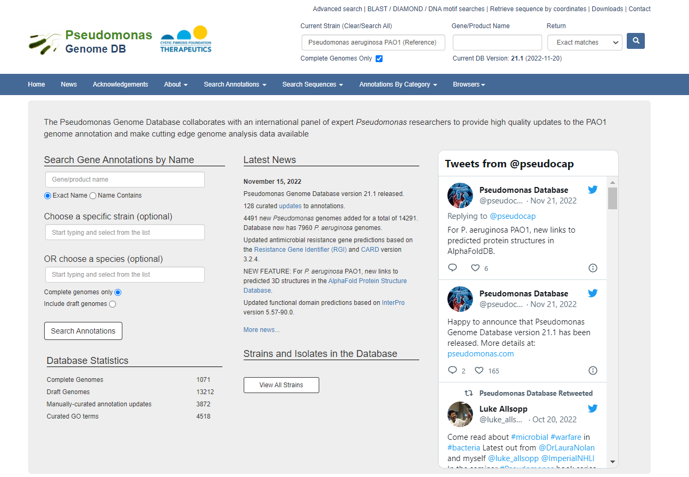

# OrthoBenchmark2023

Author: Vi Varga

Last Updated: 14.11.2023

Description: Benchmarking scripts for orthologous clustering programs

Project Aim: Creating a broadly applicable benchmarking workflow for orthologous clustering programs used by researchers working with non-model organisms. Our goal is not to replace existing benchmarking projects like the fantastically-curated [Quest for Orthologs](https://questfororthologs.org/); but instead to provide a simple alternative benchmarking toolbox to be used on a researcher's own data, and to encourage researchers to perform such benchmarking of possible tools for each new project undertaken.


## Program Installations

### Synching `conda` and Apptainer

Create an apptainer container from `conda` environment's YAML file with `conda_environment_args.def`. This script is used throughout this workflow, and is made available in the Run_Scripts/ directory. 

### CD-HIT

The CD-HIT program allows for the comparison of protein sequences. 
 - The webpage of the program can be found here: https://sites.google.com/view/cd-hit?pli=1
 - The program can be downloaded from the GitHub page, here: https://github.com/weizhongli/cdhit
 - Usage instructions can be found on the wiki, here: https://github.com/weizhongli/cdhit/wiki

```bash
# installing via conda
conda create -n env-cd-hit
conda activate env-cd-hit
conda install -c bioconda cd-hit
conda list cd-hit
# packages in environment at /home/vivarga/.conda/envs/env-cd-hit:
#
# Name                    Version                   Build  Channel
# cd-hit                    4.8.1                h2e03b76_5    bioconda
###
# create container via Apptainer
# creating a YAML file
conda env export -n env-cd-hit > env-cd-hit.yml
# creating the container from the YAML file
apptainer build --build-arg ENV_FILE=CondaYML/env-cd-hit.yml env-cd-hit.sif conda_environment_args.def
# testing to make sure it works
apptainer exec env-cd-hit.sif cd-hit -h
```

### Diamond

Diamond is a clustering and similarity searching algorithm. 
 - GitHub: https://github.com/bbuchfink/diamond
 - Documentation: https://github.com/bbuchfink/diamond/wiki
 - Clustering instructions: https://github.com/bbuchfink/diamond/wiki/Clustering

```bash
# creating a dedicated conda environment
conda create -n env-diamond
conda activate env-diamond
conda install -c bioconda -c conda-forge diamond
conda list diamond
# packages in environment at /storage/vivarga/.conda/envs/env-diamond:
#
# Name                    Version                   Build  Channel
# diamond                   2.1.8                h43eeafb_0    bioconda
# converting the conda environment to a YAML file
# working in the / directory
conda env export -n env-diamond > env-diamond.yml
# creating an Apptainer container from the YAML file
apptainer build --build-arg ENV_FILE=env-diamond.yml env-diamond.sif conda_environment_args.def
# testing that the process worked correctly
apptainer exec env-diamond.sif diamond help
```

### MMseqs2

MMseqs2 is an open source clustering program: 
 - GitHub page: https://github.com/soedinglab/MMseqs2
 - User guide: https://github.com/soedinglab/mmseqs2/wiki

```bash
# installing the program in a conda environment
conda create -n env-mmseqs2
conda activate env-mmseqs2
conda install -c bioconda mmseqs2
conda list mmseqs2
# # packages in environment at /storage/vivarga/.conda/envs/env-mmseqs2:
# #
# # Name                    Version                   Build  Channel
# mmseqs2                   14.7e284        pl5321h6a68c12_2    bioconda
conda deactivate
# creating a YAML file
conda env export -n env-mmseqs2 > env-mmseqs2.yml
# creating the container from the YAML file
apptainer build --build-arg ENV_FILE=CondaYML/env-mmseqs2.yml env-mmseqs2.sif conda_environment_args.def
# testing to make sure it works
apptainer exec env-mmseqs2.sif mmseqs -h
```

### USEARCH

This is a licensed software installed globally on the Phoebe server. 
 - Manual: https://www.drive5.com/usearch/manual8.1/
 - Command information: https://www.drive5.com/usearch/manual8.1/commands.html


## Data Collection & Storage

### Data origin & processing

This orthologous clustering benchmarking toolbox was designed as part of a larger ongoing project constructing a "gene map" of the genome of the bacterial opportinistic pathogen, _Pseudomonas aeruginosa_ (sometimes referred to in this workflow as PA/pa/Pa). Only the complete genomes of PA present in the [pseudomonas.com](https://pseudomonas.com/) database will be searched for the query genes; this is 1071 genomes, as of 15.04.2023, when this search was initiated. 



Information on these 1071 complete genomes was obtained by following the "View All Strains" link visible in the screenshot above, and then filtering the results with "Sequencing Status" = "All Complete Genome Sequences" and selection of "paeruginosa" for species filtering. A CSV file was downloaded, with the default file name of strains.csv. For the purposes of clarity, this file name was changed to PA_strains_150423.csv.

**Data Availability Note**: The amount of data used in this project is too large to host on GitHub. The list of FASTA file names is therefore included in the FASTA_name_list.txt file included in the Data_Mgmt/ directory. 

Need to decompress the *.tar.gz files of the complete genomes downloaded from the pseudomonas.com database. 

```bash
# model
tar -xvf archive.tar.gz
# applying it
tar -xvf faa-complete.tar.gz
tar -xvf fna-complete.tar.gz
#tar -xvf gbk-complete.tar.gz
tar -xvf gff-complete.tar.gz
#tar -xvf gtf-complete.tar.gz
```

Exploring the decompressed files: 
 - Will be using complete genomes only
 - Will only be using genomes that are clearly labeled as belonging to _Pseudomonas aeruginosa_

```bash
# counting the number of P. aeruginosa complete genomes
# ref: https://unix.stackexchange.com/questions/203043/count-files-in-directory-with-specific-string-on-name
ls -dq faa/*Pseudomonas_aeruginosa* | wc -l
# 494
ls -dq fna/*Pseudomonas_aeruginosa* | wc -l
# 494
ls -dq gff/*Pseudomonas_aeruginosa* | wc -l
# 494
# So at least all of them have the same number of matches
```

During the process of data exploration, it was found that some of the FASTA headers were repeated, even within the same FASTA file. A script was written to label repeated FASTA headers within a file with their copy number (script saved to `labelFASTA_dupes.py`, and made available in the Data_Mgmt/ directory). 

Encoding of protein names and creating the reference file was done with the `assignFASTAheaders_v3.py` script (made available in the Data_Mgmt/ directory). ***Note that this script was run specifically on the .faa animo acid sequence files.***

The `assignFASTAheaders_v3.py` script was run in a loop using the `run_encoding_v2.sh` script (made available in the Data_Mgmt/ directory). 

### File structures across platforms

This analysis was completed across 2 major platforms: the Phoebe server (80 cores; internal server of the Bengtsson-Palme lab) and the Vera High-Power Computer Cluster (HPC), which is operated by C3SE and part of NAISS. 

File structure on Phoebe: 

```
Working in the /storage/vivarga/OrthoBenchmark/ directory
`tree -d` # with unnecessary info removed
.
├── bin
├── CD-HIT_Results
│   ├── Identity90
│   ├── Identity95
│   └── Identity99
├── Data
│   └── Edited_faa
├── Diamond_Results
│   ├── Identity90
│   ├── Identity95
│   └── Identity99
├── OrthoFinder_Results
│   ├── Identity90
│   ├── Identity95
│   └── Identity99
├── Scripts
└── USEARCH_Results
    ├── Identity90
    ├── Identity95
    └── Identity99
```

File structure on Vera: 

```
Working in the /cephyr/NOBACKUP/groups/jbp/vivarga/ARGs_Invasion/ directory
`tree` # with unnecessary info removed
.
├── bin
├── Data
│   ├── Edited_faa
├── Orthology
│   ├── CD-HIT_Results
│   │   ├── Identity90
│   │   ├── Identity95
│   │   └── Identity99
│   ├── Diamond_Results
│   │   ├── Identity90
│   │   ├── Identity95
│   │   └── Identity99
│   └── MMseqs2_Results
│       ├── Identity90
│       ├── Identity95
│       └── Identity99
└── Scripts
```


## Running Programs

### CD-HIT

Using the program (scripts made available in the Run_Scripts/ directory): 

```bash
# working in the /cephyr/NOBACKUP/groups/jbp/vivarga/ARGs_Invasion/Scripts/ directory
chmod +x sbatch_cd-hit_PA_large_99.sh
sbatch sbatch_cd-hit_PA_large_99.sh
# Submitted batch job 5329190
job_stats.py 5329190
# https://scruffy.c3se.chalmers.se/d/vera-job/vera-job?var-jobid=5329190&from=1698162565000
# 95% identity
chmod +x sbatch_cd-hit_PA_large_95.sh
sbatch sbatch_cd-hit_PA_large_95.sh
# Submitted batch job 5329202
job_stats.py 5329202
# https://scruffy.c3se.chalmers.se/d/vera-job/vera-job?var-jobid=5329202&from=1698163444000
# 90% identity
chmod +x sbatch_cd-hit_PA_large_90.sh
sbatch sbatch_cd-hit_PA_large_90.sh
# Submitted batch job 5329205
job_stats.py 5329205
# https://scruffy.c3se.chalmers.se/d/vera-job/vera-job?var-jobid=5329205&from=1698163739000
```

### Diamond

Running the program on C3SE Vera (scripts made available in the Run_Scripts/ directory): 

```bash
# booking a 1024GB memory node (ICELAKE), 64 core/node
# 1024/64=16
sbatch sbatch_diamond_PA_large.sh
# Submitted batch job 4955181
job_stats.py 4955181
# https://scruffy.c3se.chalmers.se/d/vera-job/vera-job?var-jobid=4955181&from=1692894714000
# now running 95% ID
chmod +x sbatch_diamond_PA_large_95.sh
sbatch sbatch_diamond_PA_large_95.sh
# Submitted batch job 5329212
job_stats.py 5329212
# https://scruffy.c3se.chalmers.se/d/vera-job/vera-job?var-jobid=5329212&from=1698164831000
# running 90% ID
chmod +x sbatch_diamond_PA_large_90.sh
sbatch sbatch_diamond_PA_large_90.sh
# Submitted batch job 5329217
job_stats.py 5329217
# https://scruffy.c3se.chalmers.se/d/vera-job/vera-job?var-jobid=5329217&from=1698165574000
```

### MMseqs2

Running the program on C3SE Vera (scripts made available in the Run_Scripts/ directory): 

```bash
# running the program
chmod +x sbatch_mmseqs2_PA_large.sh
# working in the /cephyr/NOBACKUP/groups/jbp/vivarga/ARGs_Invasion/Scripts/ directory
sbatch sbatch_mmseqs2_PA_large.sh
# Submitted batch job 5327433
job_stats.py 5327433
# https://scruffy.c3se.chalmers.se/d/vera-job/vera-job?var-jobid=5327433&from=1698064440000&to=1698065223000
# running the same on lover percent identity thresholds
# 95% identity
chmod +x sbatch_mmseqs2_PA_large_95.sh
sbatch sbatch_mmseqs2_PA_large_95.sh
# Submitted batch job 5329218
job_stats.py 5329218
# https://scruffy.c3se.chalmers.se/d/vera-job/vera-job?var-jobid=5329218&from=1698165906000
# 90% identity
chmod +x sbatch_mmseqs2_PA_large_90.sh
sbatch sbatch_mmseqs2_PA_large_90.sh
# Submitted batch job 5329234
job_stats.py 5329234
# https://scruffy.c3se.chalmers.se/d/vera-job/vera-job?var-jobid=5329234&from=1698166771000
# due to the size of the results files, they need to be compressed before being transferred to Phoebe
# ref: https://www.cyberciti.biz/faq/how-to-create-tar-gz-file-in-linux-using-command-line/
tar -czvf mmIdentity99.tar.gz /cephyr/NOBACKUP/groups/jbp/vivarga/ARGs_Invasion/Orthology/MMseqs2_Results/Identity99/
# oof this takes a while
tar -czvf mmIdentity95.tar.gz /cephyr/NOBACKUP/groups/jbp/vivarga/ARGs_Invasion/Orthology/MMseqs2_Results/Identity95/
tar -czvf mmIdentity90.tar.gz /cephyr/NOBACKUP/groups/jbp/vivarga/ARGs_Invasion/Orthology/MMseqs2_Results/Identity90/
# and then extract the contents of the archives
# ref: https://linuxize.com/post/how-to-extract-unzip-tar-gz-file
tar -xf mmIdentity99.tar.gz
tar -xf mmIdentity95.tar.gz
tar -xf mmIdentity90.tar.gz
```

### USEARCH

Running the program on Phoebe (scripts made available in the Run_Scripts/ directory): 

```bash
# making the script runable from the command line
# 99% identity
chmod +x run_usearch_99.sh
nohup /storage/vivarga/OrthoBenchmark/Scripts/run_usearch_99.sh &
# [1] 169037
# (base) nohup: ignoring input and appending output to ‘nohup.out’
chmod +x run_usearch_95.sh
nohup /storage/vivarga/OrthoBenchmark/Scripts/run_usearch_95.sh &
# [1] 130025
# (base) nohup: ignoring input and appending output to ‘nohup.out’
chmod +x run_usearch_90.sh
nohup /storage/vivarga/OrthoBenchmark/Scripts/run_usearch_90.sh &
# [1] 92366
# (base) nohup: ignoring input and appending output to ‘nohup.out’
```


## Benchmarking

### Parsing results files

Each of the orthologous clustering programs used produced differently-formatted results files. In order to be able to perform comparisons of the results, I reformatted them all into 2 standardized formats: tab-separated cluster ID assignments (1 line per protein) and JSON dictionaries for each cluster. 

The `ortho_results_parser.py` script was written to parse the designated input files (made available in the Data_Mgmt/ directory).

Using it: 

```bash
# working in the ChalmersG/Clustering/OrthoBenchmark/ProgramResults/ directory
# CD-HIT
python ../Scripts/ortho_results_parser.py -i CD-HIT_Results/Concat_Pseudomonas_aeruginosa_CopyN_edit_90.clstr -c -o CD-HIT_Pa_90
python ../Scripts/ortho_results_parser.py -i CD-HIT_Results/Concat_Pseudomonas_aeruginosa_CopyN_edit_95.clstr -c -o CD-HIT_Pa_95
python ../Scripts/ortho_results_parser.py -i CD-HIT_Results/Concat_Pseudomonas_aeruginosa_CopyN_edit_99.clstr -c -o CD-HIT_Pa_99
# Diamond
python ../Scripts/ortho_results_parser.py -i Diamond_Results/PA_diamond_clust_90.txt -d -o Diamond_Pa_90
python ../Scripts/ortho_results_parser.py -i Diamond_Results/PA_diamond_clust_95.txt -d -o Diamond_Pa_95
python ../Scripts/ortho_results_parser.py -i Diamond_Results/PA_diamond_clust_99.txt -d -o Diamond_Pa_99
# MMseqs2
python ../Scripts/ortho_results_parser.py -i MMseqs2_Results/Pa_DB_90_clu.tsv -m -o MMseqs2_Pa_90
python ../Scripts/ortho_results_parser.py -i MMseqs2_Results/Pa_DB_95_clu.tsv -m -o MMseqs2_Pa_95
python ../Scripts/ortho_results_parser.py -i MMseqs2_Results/Pa_DB_99_clu.tsv -m -o MMseqs2_Pa_99
# USEARCH
python ../Scripts/ortho_results_parser.py -i USEARCH_Results/Pa_CopyN_edit__clusters_90.uc -u -o USEARCH_Pa_90
python ../Scripts/ortho_results_parser.py -i USEARCH_Results/Pa_CopyN_edit__clusters_95.uc -u -o USEARCH_Pa_95
python ../Scripts/ortho_results_parser.py -i USEARCH_Results/Pa_CopyN_edit__clusters_99.uc -u -o USEARCH_Pa_99
###
# prior to moving on, need to check that none of these files have proteins assigned to multiple orthogroups
cut -d$'\t' -f2 CD-HIT_Pa_90_parsed_pivot.txt | sort | uniq -d
# no result, which is what I was hoping for
cut -d$'\t' -f2 CD-HIT_Pa_95_parsed_pivot.txt | sort | uniq -d
cut -d$'\t' -f2 CD-HIT_Pa_99_parsed_pivot.txt | sort | uniq -d
cut -d$'\t' -f2 Diamond_Pa_90_parsed_pivot.txt | sort | uniq -d
cut -d$'\t' -f2 Diamond_Pa_95_parsed_pivot.txt | sort | uniq -d
cut -d$'\t' -f2 Diamond_Pa_99_parsed_pivot.txt | sort | uniq -d
cut -d$'\t' -f2 MMseqs2_Pa_90_parsed_pivot.txt | sort | uniq -d
cut -d$'\t' -f2 MMseqs2_Pa_95_parsed_pivot.txt | sort | uniq -d
cut -d$'\t' -f2 MMseqs2_Pa_99_parsed_pivot.txt | sort | uniq -d
cut -d$'\t' -f2 USEARCH_Pa_90_parsed_pivot.txt | sort | uniq -d
cut -d$'\t' -f2 USEARCH_Pa_95_parsed_pivot.txt | sort | uniq -d
cut -d$'\t' -f2 USEARCH_Pa_99_parsed_pivot.txt | sort | uniq -d
# no results for any
```

Data from these files was combined into one large database using the `create_ortho_db.py` (made available in the Data_Mgmt/ directory). 

Using it: 

```bash
# working in the ChalmersG/Clustering/OrthoBenchmark/ProgramResults/ directory
python ../Scripts/create_ortho_db.py CD-HIT_Pa_90_parsed_pivot.txt CD-HIT_Pa_95_parsed_pivot.txt CD-HIT_Pa_99_parsed_pivot.txt Diamond_Pa_90_parsed_pivot.txt Diamond_Pa_95_parsed_pivot.txt Diamond_Pa_99_parsed_pivot.txt MMseqs2_Pa_90_parsed_pivot.txt MMseqs2_Pa_95_parsed_pivot.txt MMseqs2_Pa_99_parsed_pivot.txt USEARCH_Pa_90_parsed_pivot.txt USEARCH_Pa_95_parsed_pivot.txt USEARCH_Pa_99_parsed_pivot.txt
# created file: Orthology_Comparison_DB__26-10-2023--174514.txt
```

### Statistical Tests

On the matter of e-values: _I have decided not to edit the e-values set by the analysis programs I used from their defaults._ This is because I feel that the percent identity thresholds I am using (minimum 90%) when comparing amino acid sequences, are high enough to rule out random chance. 

Getting basic statistics on the orthologous groups (OGs) using the `og_stats_benchmark.py` script (made available in the Analysis_Scripts/ directory).

Using it: 

```bash
# working in the Clustering/OrthoBenchmark/ProgramResults/ directory
python ../Scripts/og_stats_benchmark.py CD-HIT_Pa_90_parsed.json CD-HIT_Pa_95_parsed.json CD-HIT_Pa_99_parsed.json Diamond_Pa_90_parsed.json Diamond_Pa_95_parsed.json Diamond_Pa_99_parsed.json MMseqs2_Pa_90_parsed.json MMseqs2_Pa_95_parsed.json MMseqs2_Pa_99_parsed.json USEARCH_Pa_90_parsed.json USEARCH_Pa_95_parsed.json USEARCH_Pa_99_parsed.json
```

Creating dataframe of counts to use in boxplots using the `og_clust_counts.py` script (made available in the Analysis_Scripts/ directory). 

Using it: 

```bash
# working in the ChalmersG/Clustering/OrthoBenchmark/ProgramResults/ directory 
python ../Scripts/og_clust_counts.py Orthology_Comparison_DB__26-10-2023--174514.txt
```

Finally creating plots to use on the poster with this data (script saved to `visualize_desc_stats.R`, made available in the Analysis_Scripts/ directory). 

Cluster membership overlap is currently being assessed, but this work is still in-progress. Updates to come. 


## Program Versions

Program versions for four benchmarked orthologous clustering software: 
 - CD-HIT 4.8.1
 - Diamond 2.1.8
 - MMseqs2 14.7e284
 - USEARCH 8.0.1445_i86linux64


## References

Orthology benchmarking citations: 
 - Altenhoff, A. M., Boeckmann, B., Capella-Gutierrez, S., Dalquen, D. A., DeLuca, T., Forslund, K., Huerta-Cepas, J., Linard, B., Pereira, C., Pryszcz, L. P., Schreiber, F., da Silva, A. S., Szklarczyk, D., Train, C. M., Bork, P., Lecompte, O., von Mering, C., Xenarios, I., Sjölander, K., … Dessimoz, C. (2016). Standardized benchmarking in the quest for orthologs. *Nature Methods*, 13(5), 425–430. https://doi.org/10.1038/nmeth.3830
 - Deutekom, E. S., Snel, B., & van Dam, T. J. P. (2021). Benchmarking orthology methods using phylogenetic patterns defined at the base of Eukaryotes. *Briefings in Bioinformatics*, 22(3), 1–9. https://doi.org/10.1093/BIB/BBAA206

Program citations: 
 - Buchfink, B., Ashkenazy, H., Reuter, K., Kennedy, J. A., & Drost, H.-G. (2023). Sensitive clustering of protein sequences at tree-of-life scale using DIAMOND DeepClust. *BioRxiv*, 2023.01.24.525373. https://doi.org/10.1101/2023.01.24.525373
 - Edgar, R. C., & Bateman, A. (2010). Search and clustering orders of magnitude faster than BLAST. *Bioinformatics*, 26(19), 2460–2461. https://doi.org/10.1093/BIOINFORMATICS/BTQ461
 - Fu, L., Niu, B., Zhu, Z., Wu, S., & Li, W. (2012). CD-HIT: accelerated for clustering the next-generation sequencing data. *Bioinformatics*, 28(23), 3150–3152. https://doi.org/10.1093/BIOINFORMATICS/BTS565
 - Steinegger, M., & Söding, J. (2017). MMseqs2 enables sensitive protein sequence searching for the analysis of massive data sets. *Nature Biotechnology* 2017 35:11, 35(11), 1026–1028. https://doi.org/10.1038/nbt.3988
